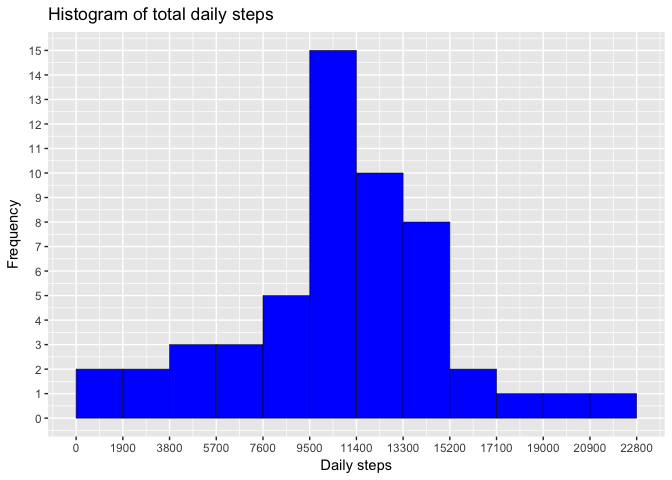
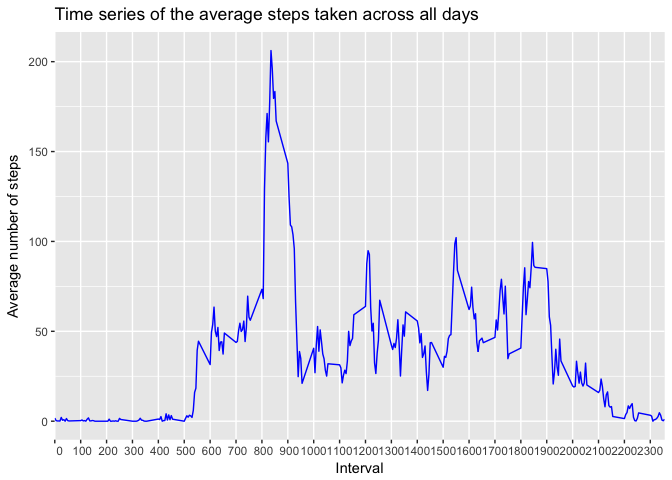
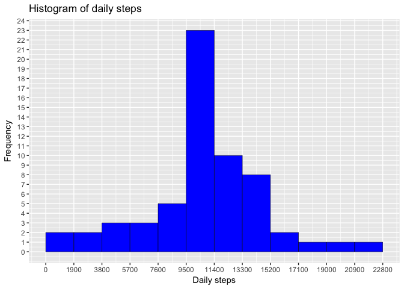
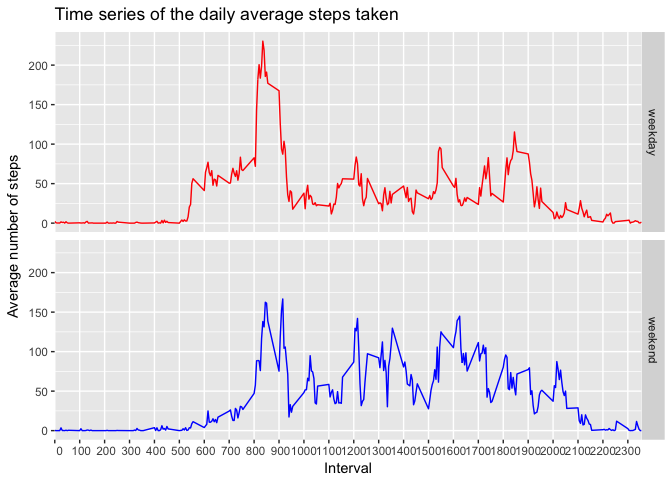

# Reproducible Research: Peer Assessment 1
Javier Rodón  
27.05.2017  

```r
rm(list = ls())
library(knitr)
opts_chunk$set(echo = TRUE, message = FALSE)
```

## Loading and preprocessing the data

As a first step we need to load the data. They are found in the **activity.zip** file as a compressed *.csv* file. The following will check if the file is already un-zipped and do so if not, then will load the data.

```r
if(!file.exists("activity.csv")) unzip("activity.zip", exdir = "./")
actMon <- read.csv("activity.csv", na.strings = "NA")
```

## What is the mean total number of steps taken per day?

For this part we will ignore the missing values in the dataset. To start we calculate the total number of steps taken per day,

```r
stepsDay <- aggregate(steps ~ date, data = actMon, sum)
```
to now plot them in a histogram.

```r
library(ggplot2)
g <- ggplot(data = stepsDay)
g + aes(steps) +
      geom_histogram(breaks = seq(0, max(stepsDay$steps)+1.9e3, by = 1.9e3),
                     col = "black", lwd = 0.2,
                     fill = "blue") +
      scale_y_continuous(breaks = c(0:20)) +
      scale_x_continuous(breaks = seq(0, 25e3, by = 1.9e3)) +
      labs(title = "Histogram of total daily steps",
           x = "Daily steps",
           y = "Frequency")
```

<!-- -->

This plot suggests that on a daily basis this person usually takes on the order of ~10.000 steps. To verify this, we calculate the mean and the median of the total daily steps,

```r
meanStepsDay <- gsub(".*?([0-9]+).*$", "\\1", summary(stepsDay)[4,2])
medianStepsDay <- gsub(".*?([0-9]+).*$", "\\1", summary(stepsDay)[3,2])
```
and we find that this person usually takes 10765 steps per day, with an average of 10766 dayly steps.

## What is the average daily activity pattern?
The following time series plot shows how many steps this person takes during an average day, on 5-minutes intervals.

```r
# Calculate the average number of steps across all days for a each 5min interval
meanTotStepsInterval <- aggregate(steps ~ interval, data = actMon, mean)

# Create the plot
g <- ggplot(data = meanTotStepsInterval)
g + aes(interval, steps) +
      geom_line(col = "blue") +
      labs(title = "Time series of the average steps taken across all days",
           y = "Average number of steps",
           x = "Interval") +
      scale_x_discrete(limits = with(meanTotStepsInterval, 
                                     seq(min(interval), max(interval), by = 100)))
```

<!-- -->

Taking into account that in the x-axis the intervals are labeled in a "HHMM" format, we can see how the highest activity period in an average day seems to be between 8:00 hs and 9:00 hs.

To confirm this we look for the 5-minutes interval with the maximum number of steps on average across all days,

```r
intMaxSteps <- which.max(meanTotStepsInterval$steps)
timeMaxSteps <- meanTotStepsInterval$interval[intMaxSteps]
timeMaxSteps
```

```
## [1] 835
```
finding that is interval 835, which represents the period 8:35 -- 8:40 in the morning.


## Imputing missing values

So far we have ignored the missing values ("NAs") in the dataset. However, this might introduce bias into some calculations or summaries of the data.

We know that there are the following number of NAs in the dataset:

```r
sum(is.na(actMon$steps))
```

```
## [1] 2304
```

We will now use the rounded mean across all days of the steps taken in the 5-minutes interval where the value is missing to fill in all those NAs, and create a new dataset without missing values.

```r
longMean <- rep(meanTotStepsInterval$steps, length(unique(actMon$date)))
actMonFull <- actMon
actMonFull$steps[is.na(actMon$steps)] <- round(longMean[is.na(actMon$steps)])
```
To see how this impacts the previous estimates, we again plot a histogram of the dayly total number of steps taken.

```r
# Total number of steps per day
stepsDayFull <- aggregate(steps ~ date, data = actMonFull, sum)
# Create the histogram
h <- ggplot(data = stepsDayFull)
h + aes(steps) +
      geom_histogram(breaks = seq(0, max(stepsDayFull$steps)+1.9e3, by = 1.9e3),
                     col = "black", lwd = 0.2,
                     fill = "blue") +
      scale_y_continuous(breaks = c(0:30)) +
      scale_x_continuous(breaks = seq(0, 25e3, by = 1.9e3)) +
      labs(title = "Histogram of daily steps",
           x = "Daily steps",
           y = "Frequency")
```

<!-- -->
Comparing with the previous histogram, we see that the only change seems to be that the most populated bin has increased its frequency. This result is intriguing. With a quick investigation, and taking into acount that in a day there are 288 5-minutes intervals, we find that the missing values correspond to whole days, and never to isolated intervals in a given day.

```r
tb <- as.data.frame(table(actMon$date[is.na(actMon$steps)]))
colnames(tb) <- c("Date", "Intervals with NAs")
tb
```

```
##          Date Intervals with NAs
## 1  2012-10-01                288
## 2  2012-10-02                  0
## 3  2012-10-03                  0
## 4  2012-10-04                  0
## 5  2012-10-05                  0
## 6  2012-10-06                  0
## 7  2012-10-07                  0
## 8  2012-10-08                288
## 9  2012-10-09                  0
## 10 2012-10-10                  0
## 11 2012-10-11                  0
## 12 2012-10-12                  0
## 13 2012-10-13                  0
## 14 2012-10-14                  0
## 15 2012-10-15                  0
## 16 2012-10-16                  0
## 17 2012-10-17                  0
## 18 2012-10-18                  0
## 19 2012-10-19                  0
## 20 2012-10-20                  0
## 21 2012-10-21                  0
## 22 2012-10-22                  0
## 23 2012-10-23                  0
## 24 2012-10-24                  0
## 25 2012-10-25                  0
## 26 2012-10-26                  0
## 27 2012-10-27                  0
## 28 2012-10-28                  0
## 29 2012-10-29                  0
## 30 2012-10-30                  0
## 31 2012-10-31                  0
## 32 2012-11-01                288
## 33 2012-11-02                  0
## 34 2012-11-03                  0
## 35 2012-11-04                288
## 36 2012-11-05                  0
## 37 2012-11-06                  0
## 38 2012-11-07                  0
## 39 2012-11-08                  0
## 40 2012-11-09                288
## 41 2012-11-10                288
## 42 2012-11-11                  0
## 43 2012-11-12                  0
## 44 2012-11-13                  0
## 45 2012-11-14                288
## 46 2012-11-15                  0
## 47 2012-11-16                  0
## 48 2012-11-17                  0
## 49 2012-11-18                  0
## 50 2012-11-19                  0
## 51 2012-11-20                  0
## 52 2012-11-21                  0
## 53 2012-11-22                  0
## 54 2012-11-23                  0
## 55 2012-11-24                  0
## 56 2012-11-25                  0
## 57 2012-11-26                  0
## 58 2012-11-27                  0
## 59 2012-11-28                  0
## 60 2012-11-29                  0
## 61 2012-11-30                288
```
Therefore the method used to populate the NAs in this case means that we are simply cloning an "average day". Therefore is not surprising that in the histogram, the only difference is that the bin containing the average number of daily steps calculated before (10766) has a higher frequency. In fact, looking more in detail we see that it is increased exactly by the amount of days with NAs.

This is also reflected in the fact that the new average of the total number of steps taken per day has not changed

```r
gsub(".*?([0-9]+).*$", "\\1", summary(stepsDayFull)[4,2])
```

```
## [1] "10766"
```
Althoug the median is now

```r
gsub(".*?([0-9]+).*$", "\\1", summary(stepsDayFull)[3,2])
```

```
## [1] "10762"
```

## Are there differences in activity patterns between weekdays and weekends?

To answer this question first we identify each day in the dataset as either a weekday or a weekend day.

```r
actMonFull$day <- ifelse(weekdays(as.Date(actMonFull$date)) %in% c("Saturday", "Sunday"), 
                         "weekend", 
                         "weekday")
```
And lastly we plot a comparison of the time series of the average number of daily steps per 5-minutes interval, discriminating between weekday and weekend days.

```r
# Calculate the average number of steps across weekdays or weekends for each 5min interval
meanTotStepsIntWday <- aggregate(steps ~ interval + day, data = actMonFull, mean)
# Create the plot
j <- ggplot(data = meanTotStepsIntWday)
j + aes(interval, steps, group = day, col = day) +
      facet_grid(day~.) +
      geom_line() +
      labs(title = "Time series of the daily average steps taken",
           y = "Average number of steps",
           x = "Interval") +
      theme(legend.position = "none") +
      scale_color_manual(values = c("red","blue")) +
      scale_x_discrete(limits = with(meanTotStepsIntWday, 
                                     seq(min(interval), max(interval), by = 100)))
```

<!-- -->
